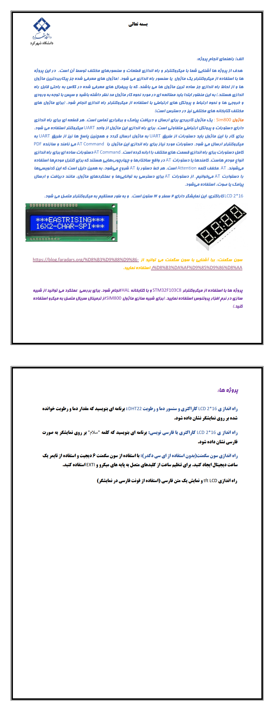

# **🧠 STM32 Microprocessor Projects | پروژه‌های میکروپروسسور STM32**

**Several university projects where questions are answered using Proteus software and HAL functions on STM32.**

**چند پروژه دانشگاهی که در آن سوالات با استفاده از نرم افزار Proteus و توابع HAL در STM32 پاسخ داده می‌شوند.**

# 💬 **نکات پروژه**

* عکس‌های برنامه در دایرکتوری ScreenShots قرار دارند.
* برای اجرا برنامه، به نرم افزار Proteus 8.16 و یا بالاتر نیاز دارید.
* گزارش‌ها، داخل دایرکتوری Report موجود هستند.
* فایل‌های هر پروژه در دایرکتوری مربوط به خود است.
* برای دسترسی به همه‌ی پروژه‌های دانشگاهی من، به این لینک مراجعه کنید:

👈🏻 **[پروژه‌های دانشگاهی من](https://github.com/bestmahdi2/Uni__Bachelors_SKU_Path)**

# 📝 **توضیحات پروژه**

# 🖼 **عکس‌های پروژه**

  
  
  
  
  

  

